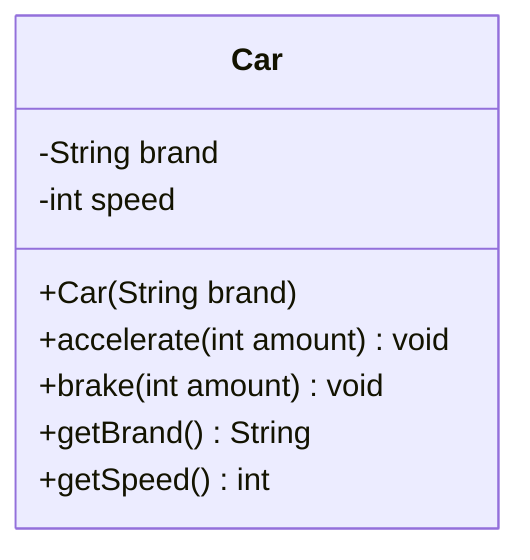
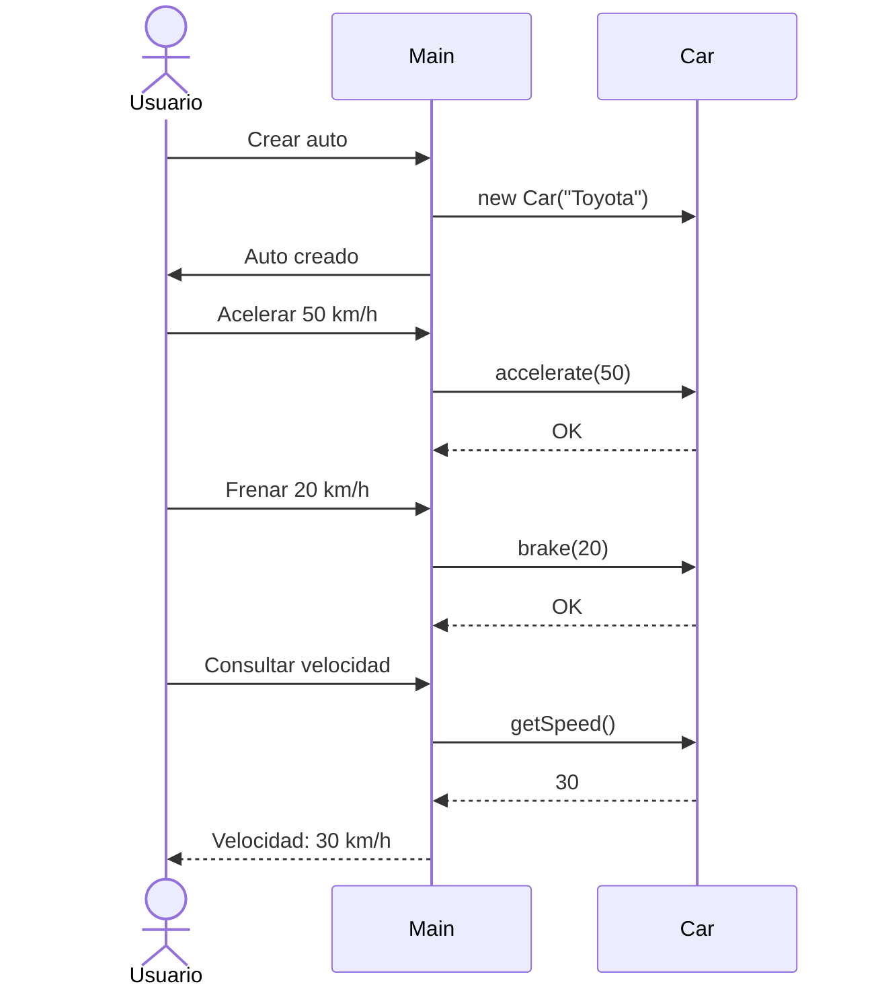

# Solución Orientada a Objetos

## Diagrama de Clases

## Flujo de ejecución

## Principios OOP aplicados

1. **Encapsulación**  
   - Atributos privados (`brand`, `speed`)  
   - Métodos públicos para interacción (`accelerate`, `brake`)  

2. **Abstracción**  
   - Ocultación de implementación (validaciones internas)  

3. **Cohesión**  
   - La clase tiene responsabilidad única: gestionar estado del vehículo  

## Beneficios clave

✅ **Seguridad de datos**  
   - Imposible asignar velocidad negativa  

✅ **Código autocontenido**  
   - Todas las operaciones relacionadas en un mismo lugar  

✅ **Facilidad de uso**  
   - Interfaz simple (`accelerate`, `brake`) oculta complejidad
