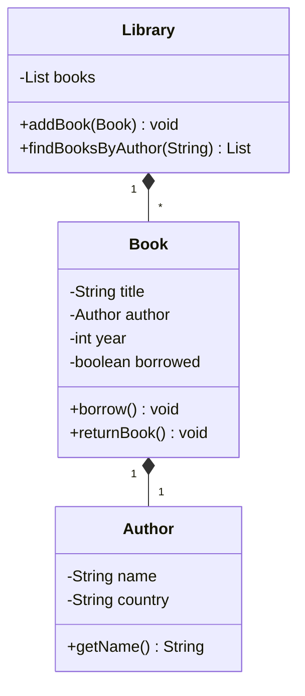

# Solución: Interacciones entre objetos

## Diagrama de Clases

## Principios OOP aplicados

1. **Composición**  
   - `Book` contiene un objeto `Author`  

2. **Colaboración**  
   - `Library` gestiona una colección de `Book`  

3. **Encapsulación**  
   - Estado interno protegido en todas las clases  

## Beneficios clave

✅ **Relaciones claras** entre entidades  

✅ **Reutilización de objetos** (mismo autor en múltiples libros)  

✅ **Código mantenible** con responsabilidades bien definidas
