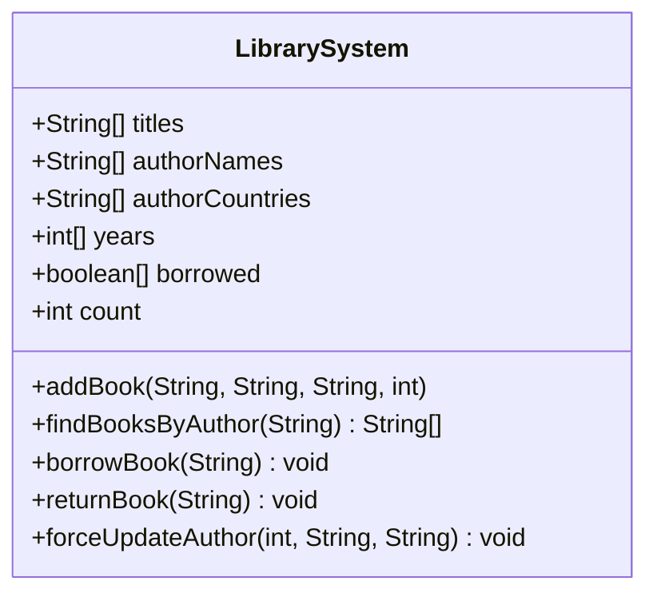

# Análisis de solución alternativa

## Diagrama del "código malo"



## Código fuente

Toda la lógica está concentrada en `src/LibrarySystem.java`:

```java
LibrarySystem library = new LibrarySystem();
library.titles[0] = "1984"; // Mutaciones directas sin controles
library.forceUpdateAuthor(0, "Orwell", "Desconocido");
library.borrowBook("1984");
```

## Problemas detectados

1. **Acoplamiento fuerte**
   - `LibrarySystem` mezcla datos de libros y autores en arreglos paralelos; cualquier cambio en la estructura obliga a rehacer toda la clase.

2. **Violación de encapsulación y falta de validaciones**
   - Todos los arreglos y contadores son públicos. Es posible poner años negativos o prestar el mismo libro múltiples veces porque no hay verificaciones.

3. **Código inflexible y difícil de extender**
   - Nuevos criterios de búsqueda implican recorrer y duplicar lógica sobre los arreglos. No existe polimorfismo ni composición.

## Beneficios de la solución buena

✅ **Bajo acoplamiento** entre clases (`Book`, `Author`, `Library`).  

✅ **Validaciones centralizadas** en métodos específicos (`borrow`, `returnBook`).  

✅ **Extensible** mediante nuevas clases o métodos sin tocar el resto del sistema.
