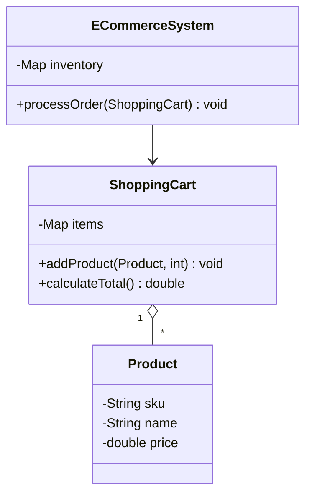

# Solución: Interacciones complejas

## Diagrama de Clases

## Principios OOP aplicados

1. **Agregación**  
   - `ShoppingCart` contiene productos sin poseer su ciclo de vida  

2. **Encapsulación**  
   - Estado interno protegido en todas las clases  

3. **Responsabilidad única**  
   - Cada clase gestiona solo su propia lógica  

## Beneficios clave

✅ **Flexibilidad** para modificar componentes individuales  

✅ **Escalabilidad** mediante nuevas funcionalidades  

✅ **Mantenibilidad** con dependencias claras
