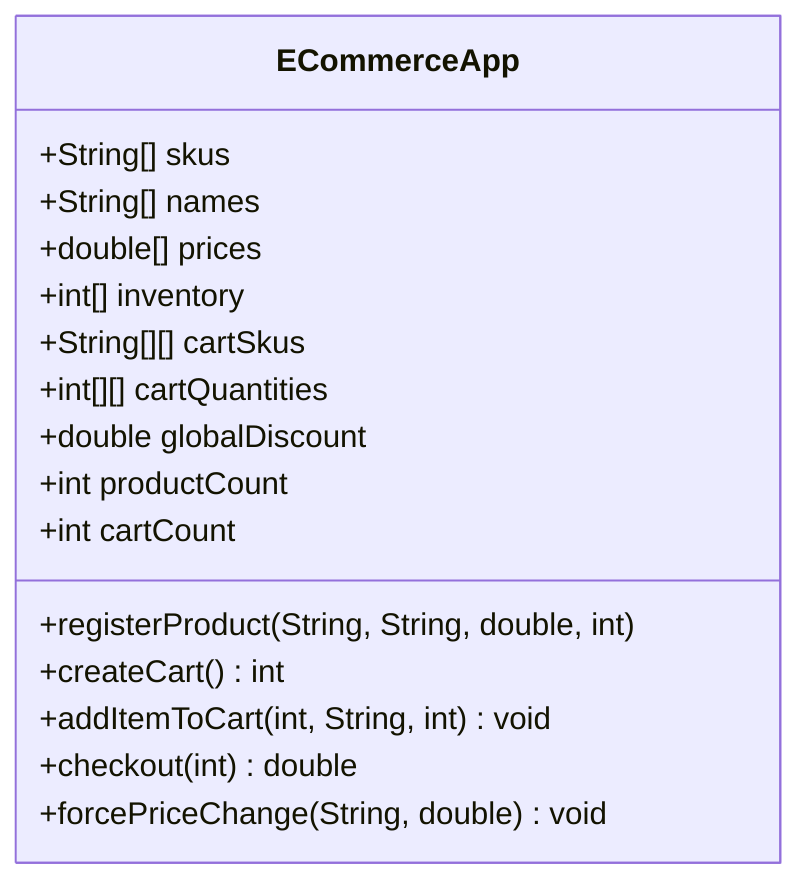

# Análisis de solución alternativa

## Diagrama del "código malo"



## Código fuente

Toda la lógica defectuosa se encuentra en `src/ECommerceApp.java` y se usa directamente desde `main`:

```java
ECommerceApp app = new ECommerceApp();
app.registerProduct("SKU-01", "Laptop", -1200, 2); // Precios negativos permitidos
int cartId = app.createCart();
app.cartSkus[cartId][0] = "SKU-01"; // Mutaciones externas
double total = app.checkout(cartId); // No valida inventario ni descuentos múltiples
```

## Problemas detectados

1. **Acoplamiento fuerte**
   - `ECommerceApp` mezcla inventario, carrito y reglas comerciales en arreglos paralelos. Cambios menores obligan a reescribir toda la clase.

2. **Gestión de estado dispersa**
   - Estructuras (`cartSkus`, `cartQuantities`) son públicas y pueden modificarse desde fuera, provocando inconsistencias entre carrito e inventario.

3. **Dificultad para testear y extender**
   - No existen interfaces ni objetos colaborativos. Probar reglas de descuento requiere crear el objeto monolítico completo y manipular sus arrays.

## Beneficios solución buena

✅ **Bajo acoplamiento** entre componentes (`Product`, `ShoppingCart`, `ECommerceSystem`).  

✅ **Lógica centralizada** en clases especializadas que encapsulan su propio estado.  

✅ **Fácil extensión** mediante nuevas implementaciones o servicios aislados.
