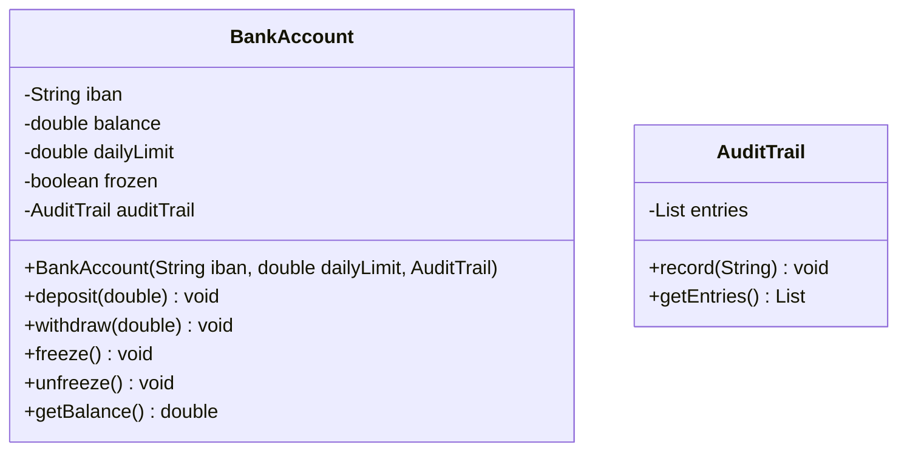

# Solución: Encapsulación avanzada

## Diagrama de clases

## Principios aplicados

1. **Encapsulación estricta**: campos privados, getters mínimos, mutaciones controladas mediante métodos que validan reglas de negocio.
2. **Inmutabilidad parcial**: IBAN y límites se configuran en constructor y no cambian.
3. **Separación de responsabilidades**: `AuditTrail` centraliza el historial de operaciones, evitando duplicidades.
4. **Inversión de dependencias ligera**: `AuditTrail` puede sustituirse por otra implementación (archivo, base de datos) sin tocar `BankAccount`.

## Beneficios

- ✅ Previene estados inválidos (sin montos negativos ni retiros en cuentas congeladas).
- ✅ Simplifica el rastreo mediante registros consistentes.
- ✅ Facilita pruebas unitarias (dependencias pequeñas, inmutables).
