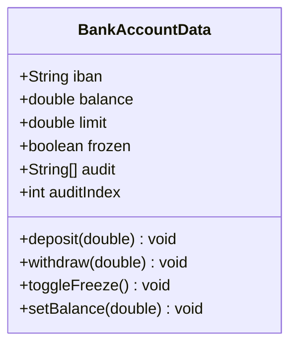

# Análisis de solución alternativa

## Diagrama del "código malo"



## Código fuente

Toda la lógica está en `src/BankAccountData.java` y se usa de forma procedural:

```java
BankAccountData data = new BankAccountData();
data.balance = -200; // Estados inválidos permitidos

data.deposit(-50);   // Ignora validaciones
if (!data.frozen) {
    data.withdraw(5000); // No respeta límites ni saldo
}
```

## Problemas detectados

1. **Encapsulación inexistente**: todos los atributos son públicos y cualquier módulo puede forzar valores ilegales (`setBalance`).
2. **Reglas dispersas**: los métodos no validan límites diarios ni estados congelados; cada llamada debe recordar verificar manualmente.
3. **Auditoría inconsistente**: el arreglo `audit` se manipula desde fuera, por lo que los registros pueden borrarse o sobrescribirse.

## Beneficios de la solución buena

- ✅ Estado protegido mediante métodos que aplican todas las validaciones.
- ✅ Registro centralizado que impide alteraciones externas.
- ✅ Base para reemplazar la auditoría sin tocar la cuenta.
