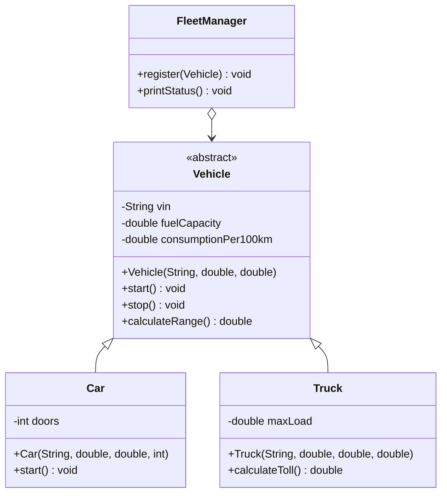

# Solución: Herencia bien diseñada

## Diagrama de clases

## Principios aplicados

1. **Herencia con propósito**: `Vehicle` encapsula comportamiento común y obliga a subclases a especializar solo lo necesario.
2. **Polimorfismo**: `FleetManager` opera sobre la abstracción `Vehicle` para recorrer flotas mixtas sin condicionales.
3. **Responsabilidad única**: cada clase mantiene una función clara (vehículo genérico, auto, camión, gestor).

## Beneficios

- ✅ Reutilización de código para cálculo de autonomía, arranque y detención.
- ✅ Facilidad para añadir nuevas subclases (`Motorcycle`, `Bus`) sin modificar `FleetManager`.
- ✅ Lógica de negocio coherente: cada método conoce solo los datos que le pertenecen.
