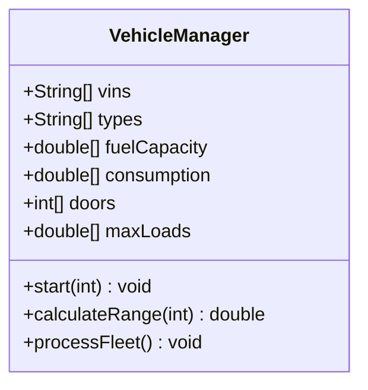

# Análisis de solución alternativa

## Diagrama del "código malo"



## Código fuente

Todo se centraliza en `src/VehicleManager.java` con condicionales según tipo:

```java
VehicleManager manager = new VehicleManager();
manager.types[0] = "car";
manager.doors[0] = 5;
manager.types[1] = "truck";
manager.maxLoads[1] = 8000;
manager.processFleet(); // Requiere if/else para cada caso
```

## Problemas detectados

1. **Herencia inexistente**: los datos de autos y camiones viven en arreglos paralelos, sin reutilizar comportamiento.
2. **Condicionales frágiles**: cada nuevo tipo obliga a duplicar bloques `if (types[i].equals("car"))` en todos los métodos.
3. **Bajo cohesion**: `VehicleManager` gestiona estado, reglas, impresión y cálculos, imposibilitando pruebas unitarias aisladas.

## Beneficios de la solución buena

- ✅ Polimorfismo real: `FleetManager` invoca métodos comunes sin conocer cada tipo.
- ✅ Código extensible: agregar `Bus` o `Motorcycle` no toca las clases existentes.
- ✅ Datos encapsulados dentro de cada vehículo, eliminando arreglos paralelos.
