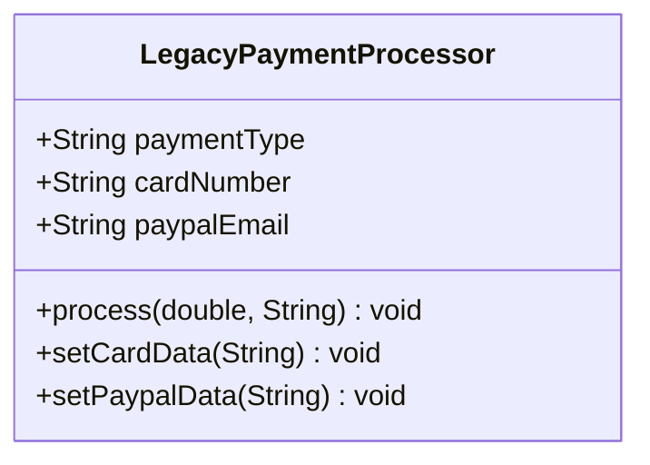

# Análisis de solución alternativa

## Diagrama del "código malo"



## Código fuente

Se concentra en `src/LegacyPaymentProcessor.java`:

```java
LegacyPaymentProcessor processor = new LegacyPaymentProcessor();
processor.setCardData("1234", "Alice");
processor.process(50, "CARD");
processor.setPaypalData("alice@example.com");
processor.process(20, "PAYPAL"); // Cambiar de método implica reconfigurar todo
```

## Problemas detectados

1. **Condicionales rígidos**: el método `process` usa `if/else` para cada tipo de pago; agregar uno nuevo requiere modificarlo.
2. **Estado compartido inseguro**: los mismos atributos (`cardNumber`, `paypalEmail`) se reutilizan para distintos pagos, provocando datos obsoletos.
3. **Dificultad para probar**: no existe interfaz; las pruebas deben instanciar la clase gigante aun si solo se necesita una rama.

## Beneficios de la solución buena

- ✅ El procesador depende del contrato `PaymentMethod`, no de detalles concretos.
- ✅ Cada implementación valida su propio estado y evita fugas de datos.
- ✅ Se pueden añadir nuevos métodos sin tocar código existente.
