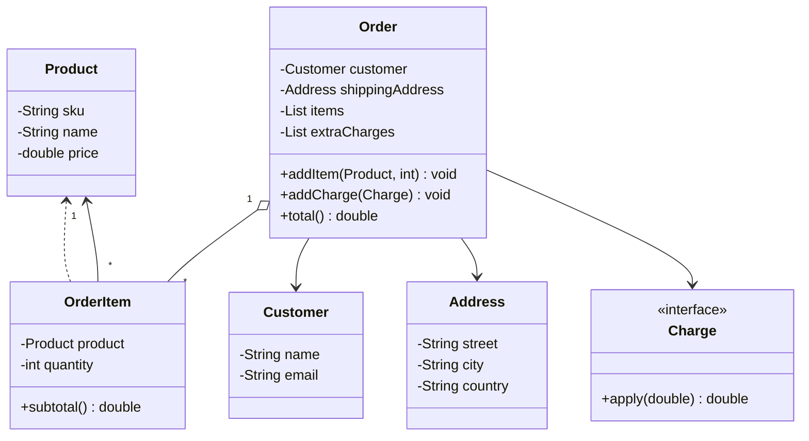

# Solución: Composición y agregación

## Diagrama de clases

## Principios aplicados

1. **Composición clara**: `Order` contiene `OrderItem` y la dirección; la vida útil depende del pedido.
2. **Agregación controlada**: `Product` y `Customer` pueden existir sin el pedido, pero se referencian para reutilizar datos.
3. **Extensibilidad vía objetos colaborativos**: `Charge` permite modelar descuentos/envíos sin modificar `Order`.

## Beneficios

- ✅ Se evita duplicar atributos de productos dentro del pedido.
- ✅ Cambiar la dirección implica reemplazar el objeto sin tocar los ítems.
- ✅ Agregar descuentos o cargos solo requiere nuevas implementaciones de `Charge`.
