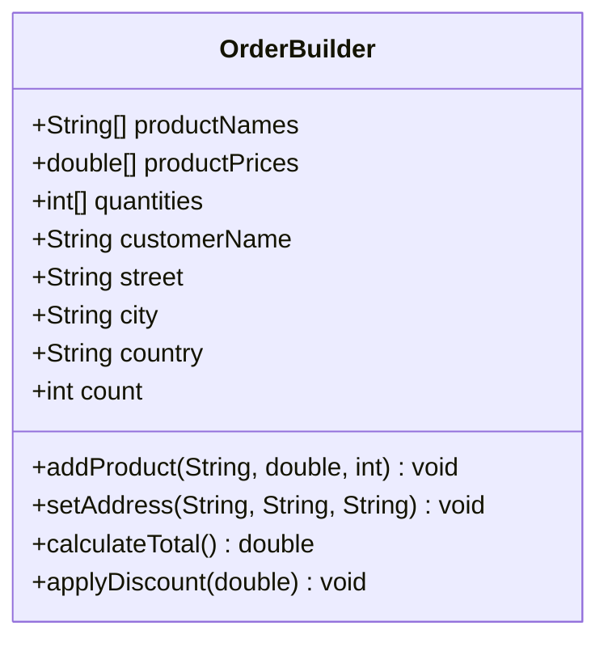

# Análisis de solución alternativa

## Diagrama del "código malo"



## Código fuente

Todo se maneja desde `src/OrderBuilder.java` mutando arreglos paralelos:

```java
OrderBuilder builder = new OrderBuilder();
builder.productNames[0] = "Laptop";
builder.productPrices[0] = 1200;
builder.quantities[0] = 2;
builder.street = "Falsa 123";
double total = builder.calculateTotal();
```

## Problemas detectados

1. **Composición inexistente**: los productos se representan como listas de strings, perdiendo la relación con `Product`.
2. **Estado compartido frágil**: cualquier cambio en dirección o descuentos implica reasignar strings manualmente.
3. **Extensibilidad nula**: para agregar cargos de envío o nuevos descuentos hay que duplicar lógica en métodos gigantes.

## Beneficios de la solución buena

- ✅ Objetos pequeños y enfocados (`Order`, `OrderItem`, `Charge`) colaboran entre sí sin duplicar datos.
- ✅ La dirección o el cliente se reemplazan por objetos completos, evitando inconsistencias.
- ✅ Nuevos cargos/descuentos se implementan como `Charge` sin tocar el resto del sistema.
