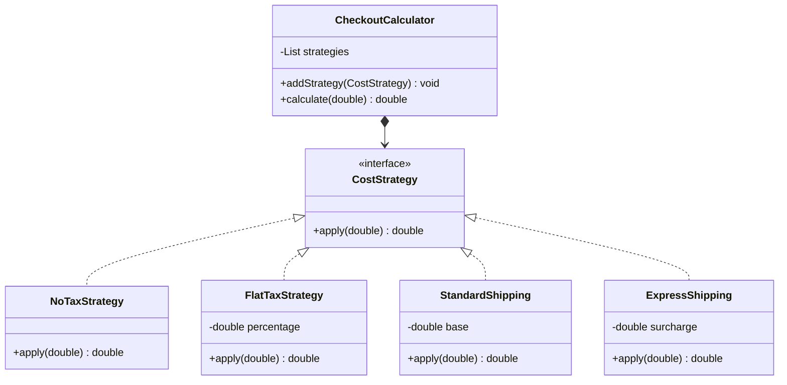

# Solución: Estrategias polimórficas

## Diagrama de clases

## Principios aplicados

1. **Patrón Strategy**: cada estrategia encapsula su regla y `CheckoutCalculator` las combina dinámicamente.
2. **Polimorfismo**: nuevas reglas se integran a través de la interfaz sin condicionales adicionales.
3. **Composición**: el calculador mantiene una lista de estrategias aplicadas en secuencia.

## Beneficios

- ✅ Fácil extender con impuestos o envíos adicionales.
- ✅ Reglas testeables de forma aislada.
- ✅ Reutilización: la misma estrategia puede aplicarse en distintos contextos.
