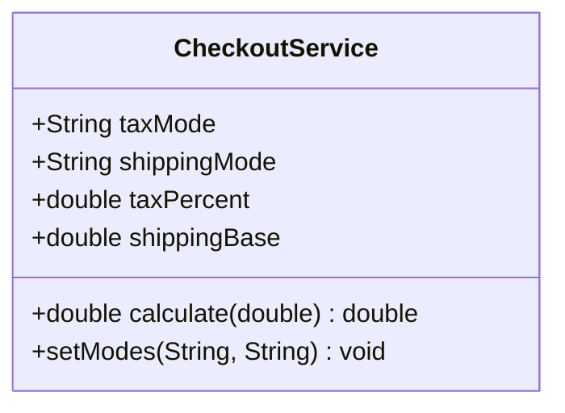

# Análisis de solución alternativa

## Diagrama del "código malo"



## Código fuente

Se concentra en `src/CheckoutService.java` con condicionales anidados:

```java
CheckoutService checkout = new CheckoutService();
checkout.setModes("FLAT", "EXPRESS");
double total = checkout.calculate(1000);
```

## Problemas detectados

1. **Condicionales en cascada**: `calculate` usa `if/else` para cada combinación de impuestos y envíos, difícil de mantener.
2. **Acoplamiento de configuraciones**: cambiar de envío obliga a reconfigurar toda la clase; no se pueden combinar múltiples estrategias fácilmente.
3. **Sin reutilización**: la lógica de impuestos no puede usarse en otros contextos sin copiar el método gigantesco.

## Beneficios de la solución buena

- ✅ Estrategias independientes y reutilizables (`CostStrategy`).
- ✅ `CheckoutCalculator` compone reglas en tiempo de ejecución sin condicionales.
- ✅ Nuevas reglas solo requieren implementar la interfaz y agregarlas a la lista.
