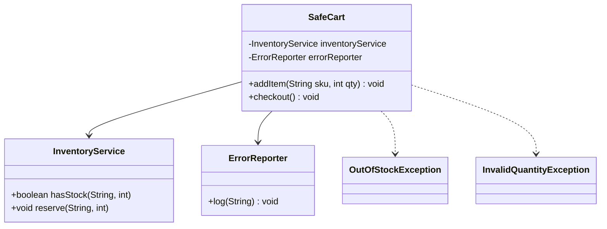

# Solución: Manejo robusto de excepciones

## Diagrama de clases

## Principios aplicados

1. **Fail-fast**: se lanzan excepciones específicas al detectar cantidades inválidas o falta de stock.
2. **Separación de responsabilidades**: `InventoryService` valida disponibilidad mientras `SafeCart` coordina operaciones.
3. **Observabilidad**: `ErrorReporter` centraliza el registro de errores críticos para auditoría.

## Beneficios

- ✅ Nunca se devuelven valores ambiguos (`null`, códigos mágicos).
- ✅ Las pruebas pueden esperar excepciones concretas y simular servicios.
- ✅ Historial claro de errores a través del reporter.
