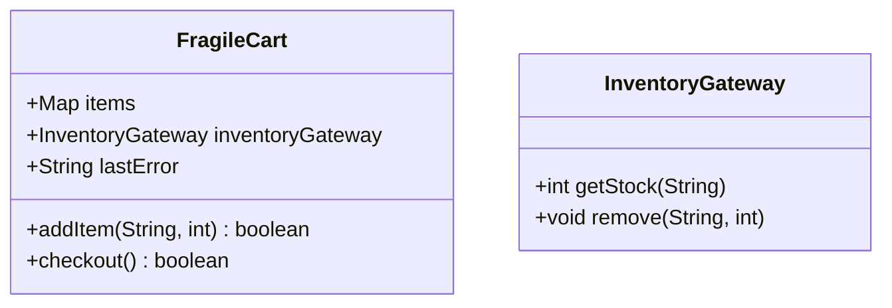

# Análisis de solución alternativa

## Diagrama del "código malo"



## Código fuente

Toda la lógica se concentra en `src/FragileCart.java` y se basa en códigos mágicos:

```java
FragileCart cart = new FragileCart(new InventoryGateway());
boolean ok = cart.addItem("ABC", -5); // Devuelve false, pero no detalla el error
if (!cart.checkout()) {
    System.out.println(cart.lastError); // Mensaje mutable y poco fiable
}
```

## Problemas detectados

1. **Errores silenciosos**: en lugar de lanzar excepciones, `addItem` y `checkout` devuelven `false`, obligando al cliente a adivinar qué pasó.
2. **Estado compartido inseguro**: `lastError` puede sobrescribirse, provocando mensajes inconsistentes.
3. **Falta de responsabilidad clara**: `FragileCart` consulta y modifica inventario sin verificar condiciones atómicas.

## Beneficios de la solución buena

- ✅ Señala fallas con excepciones explícitas (`InvalidQuantityException`, `OutOfStockException`).
- ✅ Registra el contexto con `ErrorReporter`, evitando datos mutables globales.
- ✅ Separa la verificación de stock en `InventoryService`, lo que simplifica pruebas y mantenimiento.
