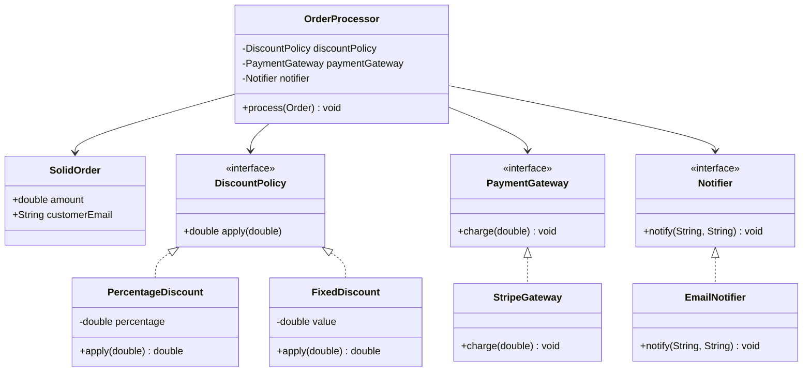

# Solución: Aplicación práctica de SOLID

## Diagrama de clases

## Principios SOLID aplicados

1. **SRP** (Responsabilidad única): `OrderProcessor` coordina el flujo, mientras descuentos, pagos y notificaciones se delegan a sus propias clases.
2. **OCP** (Abierto/Cerrado): nuevas políticas de descuento se añaden implementando `DiscountPolicy` sin tocar `OrderProcessor`.
3. **LSP**: cualquier `DiscountPolicy` o `PaymentGateway` puede sustituirse sin romper el contrato.
4. **ISP**: cada interfaz define solo los métodos necesarios (`charge`, `apply`, `notify`).
5. **DIP**: el procesador depende de abstracciones; recibe sus colaboraciones por constructor.

## Beneficios

- ✅ Escalabilidad: agregar gateways o políticas no implica modificar la clase central.
- ✅ Testabilidad: se pueden usar dobles de prueba al inyectar dependencias.
- ✅ Legibilidad: cada clase se enfoca en una tarea y evita condicionales en cascada.
